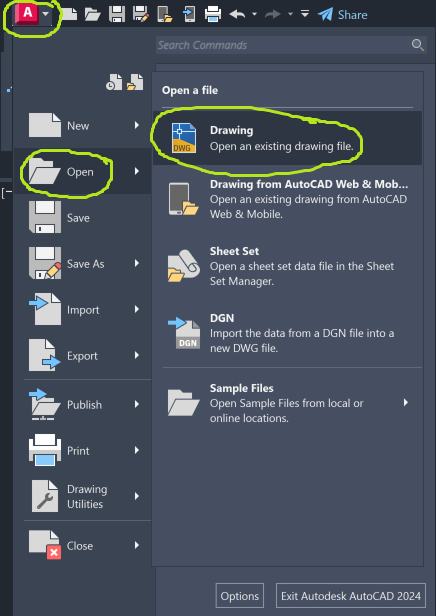

# Lesson 1
## What will you learn in this lesson?
__Lesson 1__
1. What is AutoCAD?
2. Why and when do we use AutoCAD?
3. Understanding the interface?
4. Understanding the workflow of drafting
5. Basic commands and workflow to trace and draft an object

## 1. What is AutoCAD?
AutoCAD is commonly used across various industries such as engineering, architecture, drafting, and design. The primary goal is to create precise 2D and 3D (not covered in this course) drawings that enable communication, documentation, and collaboration in modelling information within and across disciplines. Some people argue that AutoCAD is a dinosaur of software that professionals like designers and construction project managers rarely use anymore. However, **drafting 2D information in AutoCAD is still common because you can't create a 3D model without a base plan!** In other words, AutoCAD remains a useful tool to create the foundation for more advanced modelling or drafting work, especially in the 3D environment. Besides, because of its long-standing presence in the market, **many of the drafting principles in the 3D environment are based on the workflow of AutoCAD.** Therefore, by achieving a sound foundation in the software, you will be able to pick up other computer-aided design software at a much faster rate.

## 2. Why and when do we use AutoCAD?
Essentially, AutoCAD is for communicating graphical information systematically, clearly and succinctly. The software is useful for 
* Communicating geometric information, mostly 2D (common in drafting plans, product prototypes, and mapping),
* Communicating scaled information with units (available in both metrics and imperial), and
* Communicating information with annotations.

Based on these uses, the software is commonly used in the following industries,
* __Manufacturing Industries__: Small mechanical parts typically have simple repeated geometries but require extreme precision for bulk manufacturing.
* __GIS and Mapping__: Geographic Information System (GIS) professionals use AutoCAD to create lines and polygons to represent features in maps. The draft could be georeferenced and brought into GIS platforms (e.g., QGIS). Geographical information can also be brought into AutoCAD to make precise modifications, which is an advantage of AutoCAD.
* __Base Plan for 3D Modelling and Visualization__: The typical file format for AutoCAD is .dwg, which is compatible with common 3D modelling software (e.g., SketchUp, Rhino) and the whole Autodesk suite. Therefore, the 2D information can be imported as the baselines for extruding into 3D geometries, which can be further rendered using rendering tools (e.g., Enscape and Lumion).
* __Construction__: Putting this last because everyone knows how AutoCAD has been widely used to create 3D floor plans, elevations, and sections for technical drawings. The model created in AutoCAD is also widely compatible with other CAD platforms (such as VectorWorks and Microstation). The ability to coordinate with consultants using different software explains why AutoCAD remains popular in the market.

## 3. Understanding the interface
To help us understand the interface, let's download and open [Table.dwg](https://github.com/ktonguk/autocad/blob/main/lesson1/Table.dwg) in the folder. Double-click on the file in the folder you saved to open it in AutoCAD. Alternatively, you could open AutoCAD first. Then click on the AutoCAD icon at the top left-hand corner $\\rightarrow$ open $\\rightarrow$ drawing $\\rightarrow$ select the file where you saved (as shown below).

Once you open the drawing, you will see a drawing with different views of a table. The most important component of the interface is the command bar at the bottom of the screen, which looks something like this, 

AutoCAD is instructed by commands. Whether you want to draw a line, a circle or anything more complicated, you need to instruct AutoCAD by typing in commands into this line. 

To understand the interface, you first have to understand how to navigate around the interface. Let's take a quick tutorial to learn how to navigate around a drawing. 

### Pan
The drawing at first sight might not be at the centre. Press the roller on your mouse, hold and move. You should be able to move the drawing canvas sideways. Alternatively, in the command bar at the bottom, type Pan or P $\\rightarrow$ space to execute the pan command. Once executed, you should be able to use the left button on your mouse to navigate instead of the roller. 

### Zoom (Extents)
The drawing appears to be too closed. What if you would like to see the full scope of the drawing? Type Zoom or Z $\\rightarrow$ space $\\rightarrow$ E $\\rightarrow$ space. Letter E stands for extent. This will then give you the full extent of the drawing. 

### Model space
Now you should be able to move around the __model space__ quite comfortably. Where the table is at the moment is the model space. This is the space where you will draft and annotate your drawings. To ensure you are in the right space, please ensure the model space tab is always on when you are drafting.

### Ribbon of functions
Traditionally, you will have to execute all commands by typing into the command bar. This was a considerable barrier to people who needed to master the software quickly. Therefore, throughout the years, AutoCAD has improved by including a ribbon where you can find the majority of the commands in the ribbon without typing. Nonetheless, it is highly recommended that you try to remember the commands and type them into the command bar, which increases efficiency considerably. 

### Units
There is one piece of invisible information that is not readily readable from the interface but critical for your drawing, which is the units. To access the unit information, type units or un $\\rightarrow$ space. You will see a pop-up window showing the unit of the drawing, which is currently set as millimetres. If you would like to change the units, you just have to click on the drop-down menu and change it to the units appropriate for the drawing. Let's stick with millimetres for the time being.

### Properties menu
There is much more that you can extract information from the table drawing in the centre. For instance, what's the top surface area of the table? We could read the area directly from the properties menu. To access the menu, type properties or pr $\\rightarrow$ space. Go to the bottom of the pop-up menu and read the area. See if you have the same value as the screenshot below,

## Don't forget to save!
Ctrl + S works just fine in AutoCAD. You could alternatively click on the AutoCAD icon at the top left $\\rightarrow$ save. The typical format for sharing should be __.dwg__. 

Well done at following us up to this point. Now let's move into the workflow of drafting!

## __4. Understanding the workflow of drafting__
The ultimate product of AutoCAD is a drawing and a model that contains precise information to share with others. Regardless of what you need to produce, the process always starts with drafting. Drafting is different from drawing freely because drafting involves a reference point. Therefore, here are the three typical steps for drafting your first drawing in AutoCAD,
* __Set units__
  + Ensure you are drafting in the right units as required.
* __Import reference__
  + Ensure the reference is in the right units as required.
* __Draft in a draft layer__
  + Ensure all drafting lines are on the same layer.

Based on these principles, let's make our first drawing. 
### Set units
Start a new drawing by clicking on the Autodesk icon at the top left $\\rightarrow$ new $\\rightarrow$ drawing

Set units by following the steps we introduced above (type units or un $\\rightarrow$ space). Set units to millimetres (mm).

### Import reference
* Download the Example-Example 1 - simplified.pdf from the folder. Save it in the folder and next to where your current drawing is.
* Import your drawing to the model space. To do that, type pdf $\\rightarrow$ click on the top left-hand corner of the icon $\\rightarrow$ choose Example-Example 1 - simplified.pdf
* There should be a pop-up box asking you the details in terms of scale and where you want to place it, please check the selections as per below,
  

* After that, place your drawing anywhere in the model space. Click to confirm the insertion point.
  

* You will notice the drawing is a bit small. We need to scale this up. We know that length of the table is 1998mm. Therefore, we could use this as a reference. To do that, let's first create a line that is 1998mm long.
  
* #### Line command
Type Line or L $\\rightarrow$ space $\\rightarrow$ mouse to first point $\\rightarrow$ mouse to second point $\\rightarrow$ "Esc"

* #### Orthographic mode
Wait a minute... it's a line. Therefore, it's supposed to be straight. However, it's not quite straight. How can I draw a completely straight line? To do that, you will need to turn on the ortho mode in AutoCAD. Ortho mode makes all line work to be drawn orthographical at 90 degrees. To do that, press F8 or the icon at the bottom right-hand corner.

Repeat the command __Line__ and see if you can produce a completely straight line.
* #### Move
Now you have a line that is 1998mm long. Move the pdf to line up with the reference 1998mm line. To move an object, type move or m $\\rightarrow$ space $\\rightarrow$ click on the pdf object and align the pdf with the reference line.

* ### OSnap
You will notice there are little snapping points to help me aim to reference my pdf to the reference line. However, those snapping points might be absent in your interface. To activate the snapping points, simply press type osnap $\\rightarrow$ space $\\rightarrow$ check endpoints as shown below,

* ### Scale up the pdf
To scale up the drawing, type scale or sc $\\rightarrow$ space $\\rightarrow$ select base point (corner of the table) $\\rightarrow$ R $\\rightarrow$ space $\\rightarrow$ select endpoint (end corner of the table) $\\rightarrow$ select the target point for scaling up to (end of the reference line). 

* Now you have your baseline to start drafting! 

## __5. Basic commands and workflow to trace and draft an object__
Moving onto the final part of the lesson today. Let's learn some of the basic commands to draft the table pdf. By now, you should be comfortable with typing in your commands into the command bar and then executing it with the space bar. Therefore, for the materials, only the command name and the shortcut will be provided. 

* Polyline (PL)
Instead of using drafting with the command __line (L)__, we tend to draft with __Polyline (PL)__. The main reason is continuity. For the lines produced by the line command, lines are disjointed. However, more frequently, we are interested in the area / the perimeter of the geometries. Therefore, it is more common to draft them as continuous lines, which will give us one single object with an area that we can read from the properties menu right away. However, if you need lines to be disjointed, then lines will be a better option. Try using the polyline command to outline the table from the base view.

You will notice that there are snapping points throughout the reference pdf. Now try using the polyline and the line command to complete tracing the table for all views.

* Cicle (C)
There are some geometries in the pdf that cannot be drawn with lines or polylines because they are curves! For instance, the arc at the joint between the table top and the table leg is an example. Let's learn a new command, circle (C). You might struggle to find the centre of the arc. Use the osnap command introduced above, check "centre" and "midpoint".

Then use line command to draw a reference line through the arc to be sure that you have identified the centre of the arc. Followed by typing circle or c into the command bar to draw a circle that touches the arc.

* Trim (TR)
Now you have the arc, what we need to do is to remove the unwanted lines. To do that, draw a line to divide the circle. Then type trim or tr $\\rightarrow$ space $\\rightarrow$ and select the part you want to trim. Then you should be able to get the arc for your table leg.

The commands introduced throughout lesson one should enable you to complete the whole drawing. Keep practising and we will see each other in Lesson 2.

Thank you for your time in doing this session with us!
